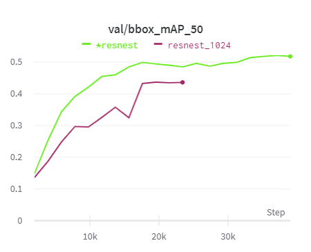
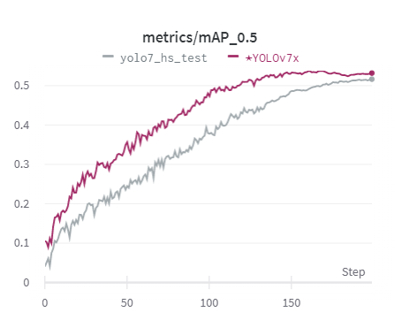

# 🏆재활용 품목 분류를 위한 Object Detection🏆

***
## 🔥Member
| [정승윤](https://github.com/syoon6682) | [김주희](https://github.com/alias26) | [신현수](https://github.com/Hyun-soo-Shin) | [이우택](https://github.com/dldnxor) | [이해욱](https://github.com/woooo-k) |
| :-: | :-: | :-: | :-: | :-: |
|  |  |  |  |  |
***
## Index
- [🏅Project Summary](#project-summary)
- [👨‍👩‍👧‍👧Team Roles](#team-roles)
- [🗃️Procedures](#️procedures)
- [🌿Features](#features)
- [📊Result](#result)
- [👨‍💻Conclusion](#conclusion)
- [💻Requirements](#requirements)
- [🏗️Folder Structure](#️folder-structure)
***
## 🏅Project Summary

>### - 프로젝트 주제
> 쓰레기 이미지에서 Object Detection을 활용하여 10종류 클래스의 쓰레기로 추측할 수 있다. 카메라를 이용한 분리수거 판별을 통해 올바르게 분리수거가 되어 있는지 알 수 있다.
>
>### - 개요 및 기대효과
>Object Detection Task 대회를 진행하면서 EDA, Modeling, Ensemble 등 다양한 테스크를 경험해볼 수 있고 이를 수행하면서 Object Detection에 대한 이해도를 높일 수 있다. 기대 효과로는 쓰레기장에 설치되어 정확한 분리수거를 돕거나, 어린아이들의 분리수거 교육 등에 활용
>
>### - 활용 장비 및 재료 
>서버: V100 GPU
라이브러리: MMDetection, Yolov7, UniverseNet(MMdetection Base)
개발 및 협업 툴: Git, Slack, Zoom, Visual Studio Code
>
> ### - 데이터 셋의 구조도
> - **데이터셋 통계**
>- 전체 이미지 개수 : 9754장
>- 10 class : General trash, Paper, Paper pack, Metal, Glass, Plastic, Styrofoam, Plastic bag, Battery, Clothing
>- 이미지 크기 : (1024, 1024)
>- 데이터셋 형태 : COCO Dataset
> - **Annotation file**
>
>    - annotation file은 coco format 으로 이루어져 있습니다.
>
>    - coco format은 크게 2가지 (images, annotations)의 정보를 가지고 있습니다.
>
> - images :
>    - id : 파일 안에서 image 고유 id, ex) 1
>    - height : 1024
>    - width : 1024
>    - filename : ex) train/0002.jpg
>
---
## 👨‍👩‍👧‍👧Team Roles
>- **이우택**: EDA, Cascade-RCNN, Swin-L 모델
>- **정승윤**: YOLO 모델 및 ResNest 모델 구현, Git merge 
>- **김주희**: Streamlit Image Bbox Viz, Predict, UniverseNet, Augmentation, 아이디어 제공
>- **이해욱**: 팀원들 코드 보면서 따로 공부
>- **신현수**: Dataset Split, 2-stage Detector 모델 구현
---
## 🗃️Procedures
>**[2022.11.14 ~ 2022.11.16]**
>- Detection 강의 수강 및 프로젝트 기획
>- 서버 설정 및 개발 환경 setting
><br>
>
>**[2022.11.16 ~ 2022.11.18]**
>- Baseline Code 이해 및 분석
>  - 자체적인 토론 및 오피스아워 수강을 통해 이해 및 분석을 진행함
><br>
>
>**[2022.11.19 ~ 2022.11.23]**
>- Baseline Code 공통 코드 개발
>  - Streamlit
>  - WandB 설정
>  - Train, valid dataset split
>  - EDA & confusion matrix code  
><br>
>
>**[2022.11.23 ~ 2022.11.29]**
>- 개별 model 선정 및 학습 진행
>  - 주로 활용한 모델은 ResNet, ResNest, Cascade RCNN, Swin transformer, UniverseNet, Yolov7 등을 활용함	
><br>
>
>**[2022.11.30 ~ 2022.11.30]**  
>- Ensemble 진행 및 최종 결과 제출 
>  - Ensemble 과정에서 iou threshold, bbox fusion, soft nms, weight를 조절하며 최적의 결과값을 찾음
>- Github repository 결과물 정리
>  - 각자 branch를 convention을 정해서 merge 진행
>  - Readme 작성

---
## 🌿Features
>**feat-wandb**: Wandb logging 설정  
>**feat-streamlit**: streamlit을 통한 EDA, Augmentation, Predict 기능 개발  
>**feat-syoon-work**: Resnest, Yolov7x 실험  
>**feat-universenet**: universenet 실험
>**feat-valid_setting**: Train Dataset에서 Valid Dataset 분리
>
---
## 📊Result
>### 탐색적 분석(EDA) 및 데이터 전처리
>>* **이미지 당 annotation 수**
>>
>>
>>
>>이미지가 대체로 적은 수의 annotation을 가짐. 간혹 하나의 이미지에 지나치게 많은 annotation이 존재하기도 한다는 것을 알 수 있음.
>
>>* **하나의 이미지가 가지는 class 수 분포**
>>
>>
>>
>>최소 1가지 종류의 class만 포함된 이미지가 가장 많고 최대 7가지 class를 포함한 이미지가 있음.
>
>>* **Class 당 annotation 분포**
>>
>>
>>
>>General trash, Paper, Plastic bag의 비율이 매우 높은 반면, Battery의 비율이 굉장히 낮음을 알 수 있음.
>
>>* **Bounding Box의 크기 비율**
>>
>>
>>
>>대체로 이미지의 0~10% 정도의 크기를 차지한다는 것을 알 수 있음.
>
>>* **Bounding Box의 위치 분포**
>>
>>
>>
>>대체로 Bounding Box는 이미지의 중앙 부분에 위치한다는 것을 알 수 있음.
>
>>* **Class별 Bounding Box의 width/height 비율 분포**
>>
>>
>>
>>비율이 1.0~1.5 사이인 것으로 보아 대체로 정사각형에 가깝거나 가로가 약간 긴 모양의 Bounding Box를 가지고 있음.
>
>#### 데이터 전처리
>* 모델의 다양한 실험 및 평가를 위해 주어진 Train Dataset을 다시 Train과 Valid Dataset으로 분리해주었음. 분리를 하는 과정에서 class 분포를 균일하게 하기 위해 stratified-split을 사용하였음.


---
### Data Augmentation
|Mosiac|RandomCrop|ColorTransform|Paste In|
|----|----|----|----|
|||||

### 모델 개요
>큰 BackBone 구조의 Object Detection Model들이 학습을 잘하고 데이터가 가지고 있는 문제를 해결하기 어려워 앙상블을 통해 성능 향상을 목표
Cascade, Yolo, UniverseNet 학습에 사용
학습한 모델들의 Confusion Matrix를 시각화하고 이를 바탕으로 모델별로 가중치를 결정하고 Weight Box Fusion을 통해서 앙상블

### Ensemble

#### NMS
>- NMS의 IoU threshold는 실험을 통해 0.6이 가장 좋은 결과를 가져서 0.6으로 고정하고 앙상블을 진행함.
>- Soft NMS가 Detection에 좋은 효과가 있다고 알려져있어 활용해보았으나 오히려 성능이 떨어짐. 그 이유로 우리 모델이 앙상블 과정에서 너무 많은 bbox를 포함한 탓에 우리 모델에서는 성능을 낮추었다고 생각함.
#### Weighted Boxes Fusion
> - WBF의 IoU threshold는 실험을 통해 0.6이 가장 좋은 결과를 가져서 0.6으로 고정하고 앙상블을 진행함.
>-  모델별 mAP 성능을 기준으로 가중치를 주고 앙상블을 진행한 결과 mAP의 점수가 높아졌음.


### 시연결과
**Confusion Matrix**
|Cascade ResNet152|Cascade ResNest200|Cascade Swin-T|UniverseNet|Yolov7x|
|----|----|----|----|----|
||||||

**Metric : mAP50**
|Cascade ResNet152|Cascade ResNest200|Cascade Swin-T|UniverseNet|Yolov7x|
|----|----|----|----|----|
|<div style="text-align: center">0.5173</div>|<div style="text-align: center">0.5092</div>|<div style="text-align: center">0.5292</div>|<div style="text-align: center">0.5665</div>|<div style="text-align: center">0.5374</div>|

|Ensemble Weight Box Fusion|
|----|
|<div style="text-align: center">0.6258</div>|
---
## 👨‍💻Conclusion
>#### 잘한 점들
>1. EDA를 통해 데이터 분석를 분석하고 각 모델별 EDA 및 Predict를 실험해 볼 수 있었다.
>2. 적극적인 팀원들간 소통으로 실험 관리 및 협업 유지를 잘했다.
>3. MMdetection에만 국한되지 않고 다양한 라이브러리 및 소스로부터 모델을 학습시켜보았다. 
>
>#### 아쉬운 점들
>1. Git을 통한 Project ToDo, Issue 관리가 미흡했다.
>2. 모델 학습하는 과정에서 모델을 빠르게 정하지 못했고 큰 구조의 모델 학습을 빨리 시도해봤어야 했다.
>3. 전처리를 시도를 많이 못해봐서 아쉽다.
>
> #### 프로젝트를 통해 배운점
>1. Data Imbalance, Label 문제 등 데이터의 전처리 및 구조가 중요하다는 점을 깨달았다.
Wandb, Data Viz 등을 통해 모델의 학습 그래프의 시각화 및 로깅을 통한 실험 관리의 이점을 알 수 있었다.
>2. Ensemble을 경험해보고 Ensemble의 이점을 배울 수 있었다. 

---
## 💻Requirements
```
conda install pytorch=1.7.1 cudatoolkit=11.0 torchvision -c pytorch  
pip install openmim  
mim install mmdet  
```
---
## 🏗️Folder Structure
```
├── mmdetection  
│     ├── ResNet152  
│     ├── ResNest200  
│     └── SwinT    
│  
├── UniverseNet  
│     └── UniverseNet  
│ 
├── yolov7  
│     └── YOLOv7x  
│   
└── dataset  
│     ├── train.json  
│     ├── train_split.json  
│     └── valid_split.json  
```
---
